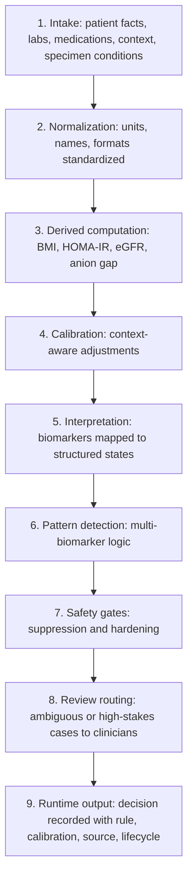

The Consensus Engine is a structured interpretation layer between raw health data and clinical decision-making. It does not simply display lab values. It evaluates patient facts, biomarker values, context, safety conditions, calibration rules, and evidence-linked logic to produce a structured clinical state.

The system is configuration-driven. Clinical logic lives in the reviewed engine schema, not scattered across application code. This makes the engine easier to review, test, update, audit, and govern. Schema v2.8.4 includes 67 tables across reference data, interpretation, derived formulas, calibrations, patterns, treatments, safety, runtime outputs, and governance.

## High-level flow

The engine follows a controlled sequence. It does not jump from a lab value to a conclusion. It moves through layers that progressively add context and remove unsafe certainty.



## Input layer: patient facts and clinical context

The engine evaluates a defined catalog of runtime facts. These facts are the input contract of the system. They include profile fields, derived values, biomarker states, derived flags, specimen quality facts, and longitudinal data.

| Category | Examples |
| --- | --- |
| Profile | Biological sex, age, fasting status, pregnancy status, current medications |
| Anthropometrics | Weight, height, BMI, waist when available |
| Lab values | Glucose, HbA1c, insulin, lipids, ferritin, ALT, creatinine, vitamin D, and others |
| Specimen context | Assay method, dehydration at draw, time of draw |
| Medication context | Biotin use, hormone therapy, GLP-1 use, statins, supplements, other relevant exposures |
| Longitudinal context | Prior values, time since previous test, direction of change, persistence over time |
| Genetic or phenotype context | APOL1, Duffy/ACKR1, hemoglobinopathy signals, ancestry-related calibration inputs |

A biomarker rarely speaks alone. The same value may mean different things depending on fasting status, pregnancy, recent illness, medication use, assay interference, genotype, or prior trend.

## Normalization layer: one language for clinical data

Before interpretation, the engine must make inputs consistent. The normalization layer standardizes biomarker identifiers, units, aliases, and accepted value formats. A lab may report the same biomarker under different names or with different units. The engine needs a single source of truth so the same clinical value is interpreted consistently.

The architecture identifies `BIOMARKERS`, `REF_SOURCES`, and `UNITS_CONVERSION` as representative reference tables, supporting canonical biomarkers, evidence sources, and unit conversion governance. The engine should not produce different interpretations because two labs used different labels or units for the same biological measurement.

## Derived computation layer

Some clinical signals are not directly measured. They are calculated from multiple inputs. The derived layer computes indices and formulas where the required inputs are available, such as BMI, HOMA-IR, eGFR, and anion gap. The schema separates these formulas into structured tables so they can be reviewed, versioned, and tested.

This gives the engine two advantages: it can interpret more than isolated lab values, and it can make derived logic auditable. If a derived state was used in a decision, the system can show which formula was applied and which inputs were used.

## Calibration layer: context before interpretation

After normalization and derived computation, the engine applies calibration logic where relevant. A calibration is a structured adjustment to interpretation based on defined conditions such as genotype, phenotype, ancestry-linked mechanism, specimen context, medication exposure, or clinical context. Each calibration is versioned, evidence-linked, and governed through review.

Example calibration domains include the Duffy-null / ACKR1 phenotype, APOL1 high-risk genotype, hemoglobinopathies affecting HbA1c, and vitamin D by ancestry or altitude. The engine applies calibration before final interpretation because the meaning of a value may change once the relevant context is known. This prevents the system from treating a generic reference range as if it were universally correct.

## Interpretation layer: structured states, not free-text conclusions

The interpretation layer maps biomarkers and patterns into structured states.

| State | Meaning | Patient-visible |
| --- | --- | --- |
| `OPTIMAL` | Longevity-favorable or better than standard population range | Yes |
| `NORMAL` | Within standard clinical range | Yes |
| `WATCH` | In range, but trending or preventive relevance exists | Yes |
| `ACTION` | Outside range or intervention may be considered | Yes |
| `CRITICAL` | Urgent clinical attention required | Yes |
| `INSUFFICIENT_DATA` | Required inputs are missing or unavailable | Yes |
| `AWAITING_REVIEW` | Engine needs clinician interpretation | No |
| `REQUIRES_CLINICAL_CORRELATION` | Ambiguous result requiring clinician correlation | No |
| `NOT_APPLICABLE` | Rule or interpretation does not apply to the patient | No |

The review states are a core safety feature. They allow the engine to pause and escalate instead of producing a false sense of certainty.

## Pattern layer: multiple signals interpreted together

Many preventive signals are not visible in one biomarker. They appear as a pattern across multiple markers. The pattern layer evaluates combinations of biomarkers using defined anchors, exclusions, and supporting conditions. This identifies clinically meaningful constellations without relying on open-ended AI reasoning.

Metabolic risk may involve glucose, HbA1c, fasting insulin, HOMA-IR, triglycerides, HDL, BMI, waist, and longitudinal movement. Liver risk may involve ALT, AST, GGT, platelets, BMI, alcohol context, medications, and derived scores.

<Note>
  Pattern recognition remains structured. The engine does not let an AI model invent a pattern. The pattern must exist as reviewed logic in the schema.
</Note>

## Safety layer: suppressions and clinical hardening

Before an interpretation reaches the patient, safety rules can suppress, delay, or escalate the output.

| Safety mechanism | Behavior |
| --- | --- |
| Pregnancy suppression | Affected interpretations are suppressed during pregnancy |
| Acute illness suppression | Confounded markers may be suppressed for up to 14 days after acute illness |
| Recent strenuous exercise suppression | Creatinine, CK, and AST may be suppressed when recent exercise can confound interpretation |
| Diabetes hardening | Diabetes is not asserted from a single value without confirmation or appropriate clinical context |
| CKD hardening | Chronic kidney disease requires sustained evidence over time |
| Fasting gate | Fasting-dependent markers require confirmed fasting status |

These rules prevent the engine from treating temporary, confounded, or incomplete data as a stable clinical conclusion.

## Runtime output: the decision record

Every engine evaluation produces a structured runtime output record. This record includes a unique `decision_id`, patient and organization references, input facts considered, rules fired, calibrations applied, resulting state, and cited evidence.

The traceability chain is:

```
Input facts → calibration applied → rule fired → evidence cited → state produced → clinician review when required
```

This is the audit backbone of the system. Any interpretation can be reconstructed later, including which rule version and calibration version were active at the time.

## Why this architecture matters

The architecture is designed to avoid three unsafe extremes:

- A simple dashboard that shows values without context.
- A black-box AI system that generates clinical conclusions without reproducible logic.
- Over-automated medicine, where possible eligibility or risk is mistaken for a clinical decision.

Consensus Engine sits in the middle: structured enough to be auditable, flexible enough to support preventive interpretation, and conservative enough to route uncertainty to clinicians.
